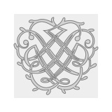

# BWV 1006


```
docker run -v  $(pwd):/work codello/lilypond:dev bwv1006.ly
docker run -v  $(pwd):/work codello/lilypond:dev --svg bwv1006.ly
docker run -v  $(pwd):/work codello/lilypond:dev --svg bwv1006_ly_one_line.ly
python3 scripts/midi_map.py
python3 scripts/svg_extract_note_heads.py
python3 scripts/align_pitch_by_geometry_simplified.py

python3 -m http.server
```


